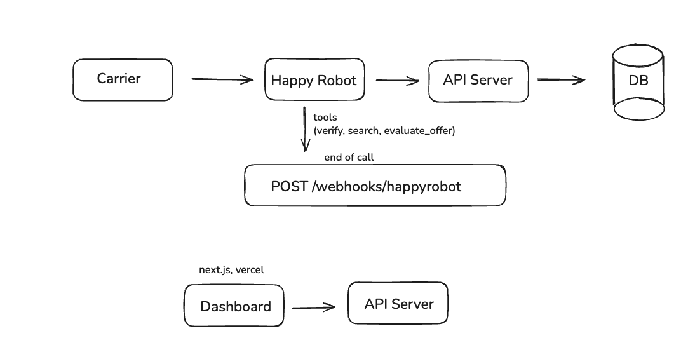

# HappyRobot Carrier Sales — Take-home

Inbound carrier-call automation. The HappyRobot voice agent verifies the carrier with FMCSA, looks up the load by reference number, negotiates a rate up to 3 rounds, and POSTs the full call back to us via webhook. Everything lands in Postgres and surfaces live on a dashboard.

- **Dashboard**: `https://happyrobot-takehome.vercel.app`
- **API**: `https://happyrobot-takehome-production-54e7.up.railway.app` — health check at `/health`
- **Demo video**: `https://<video-url>`

---

## Architecture



The Carrier reaches the HappyRobot voice agent, which calls our API server (`verify_carrier`, `find_available_loads`, `evaluate_offer`) and POSTs to `/webhooks/happyrobot` at end-of-call. The dashboard (Next.js on Vercel) reads through the same API server — no direct DB access in the browser.

---

## API routes

All agent-facing routes require `X-API-Key: <API_KEY>`.

### Agent tools

| Tool | Route | Notes |
|---|---|---|
| `verify_carrier` | `GET /carriers/verify?mc_number=…&session_id=…` | Wraps FMCSA. Caches `(session_id → carrier_name)` so the webhook can fill carrier name later without HR templating it. |
| `find_available_loads` | `GET /loads/search?reference_number=…` | Exact match on `load_id`. Returns `{ count, loads[] }`. |
| `find_available_loads` (fallback) | `GET /loads/search?origin=…&equipment_type=…` | Up to 5 matches by lane/equipment when no reference number. |
| `evaluate_offer` | `POST /loads/:load_id/evaluate-offer` body `{ session_id, offer }` | Server tracks rounds in memory by `session_id`. Returns `accept` / `counter` / `reject` + the right rate. |

### End-of-call webhook

`POST /webhooks/happyrobot` — header `X-Webhook-Secret: <HAPPY_ROBOT_WEBHOOK_SECRET>` (or `Authorization: Bearer …`). Idempotent on `session_id`. Body fields (snake or camel case, unused fields are ignored):

```jsonc
{
  "session_id":            "...",          // REQUIRED — upsert key
  "outcome":               "booked",       // optional, derived from `classification` if absent
  "classification":        "Success",      // mapped to our enum
  "classification_reasoning": "...",       // becomes ai_summary
  "sentiment":             "positive",
  "mc_number":             "...",
  "reference_number":      "LD1001",       // mapped to load_id, validated against the loads table
  "decline_reason":        "...",
  "transcript":            "[...]",
  "duration":              42,
  "caller_number":         "+1..."
}
```

`call_id` is generated by us (`CL{uuid}`) — never sent by HR. Negotiation stats (`initial_rate`, `final_rate`, `num_offers`) come from server-side memory keyed by `session_id`; HR doesn't need to template them.

### Dashboard / read-only

| Route | Purpose |
|---|---|
| `GET /loads` | All loads (loads table). |
| `GET /loads/:load_id` | One load. |
| `PATCH /loads/:load_id` | Update notes. |
| `GET /calls?limit=N` | Recent calls. |
| `GET /health` | Unauthenticated probe (Railway). |

---

## Negotiation approach

Server-side decision logic in `api/src/services/negotiationService.ts`. The agent never invents counters — it relays our decision.

**Where floor / ceiling come from**: regex-parsed from each load's `notes` column (`Floor: $1700`, `Ceiling $2650`, `Authorized to $X`, `Hard cap $X`, `$X ceiling`). If a value isn't in notes, fall back to `loadboard_rate × 0.9` (floor) and `× 1.1` (ceiling).

**Decision tree** (round capped at 3):

```
offer ≤ posted                           → accept at offer
posted < offer ≤ ceiling
   round < 3 → counter at midpoint(offer, posted), rounded to nearest $25
   round = 3 → accept at offer (final-round close)
ceiling < offer ≤ ceiling × 1.15
   round < 3 → counter at ceiling (hold the line)
   round = 3 → reject
offer > ceiling × 1.15                   → reject immediately
```

Rounds are tracked server-side in an in-memory map keyed by `session_id`. The map also captures `initial_rate` (the load's posted rate, not the carrier's first ask) and `final_rate` (the latest decision). The end-of-call webhook reads and clears these via `consumeStats(session_id)`. Single instance only — would move to Redis to scale out.

---

## Local development

Prereqs: Node 22, Supabase project (free tier), FMCSA web key.

```bash
git clone <repo>
cd happyrobot-takehome

# 1. Database
#    Open the Supabase SQL editor and run:
cat db/schema.sql   # copy/paste, run
cat db/seed.sql     # copy/paste, run

# 2. API
cd api
cp .env.example .env       # fill in SUPABASE_*, FMCSA_WEBKEY, API_KEY (openssl rand -hex 32)
npm install
npm run dev                # http://localhost:3000/health

# 3. Dashboard (separate shell)
cd ../dashboard
cp .env.example .env.local # fill in API_BASE_URL=http://localhost:3000, API_KEY=<same as api>,
                           # NEXT_PUBLIC_SUPABASE_URL, NEXT_PUBLIC_SUPABASE_ANON_KEY
npm install
npm run dev                # http://localhost:3001
```

To expose the local API to HappyRobot for live testing:

```bash
npx ngrok http 3000
# Use the https://*.ngrok-free.app URL as API_BASE_URL in your HR workflow.
```

Or via Docker (API only, against hosted Supabase):

```bash
docker compose --env-file api/.env up --build
```

---

## Testing

**Health & auth**

```bash
curl https://happyrobot-takehome-production-54e7.up.railway.app/health

curl -H "x-api-key: $API_KEY" \
  "https://happyrobot-takehome-production-54e7.up.railway.app/loads/search?reference_number=LD1001"
```

**Negotiation walk-through** (carrier asking $2000 on $1850 load with $2035 ceiling):

```bash
SESSION="test_$(uuidgen)"
for offer in 2000 1925; do
  curl -s -H "x-api-key: $API_KEY" -H "content-type: application/json" \
    -d "{\"session_id\":\"$SESSION\",\"offer\":$offer}" \
    https://happyrobot-takehome-production-54e7.up.railway.app/loads/LD1002/evaluate-offer | jq
done
# round 1 → counter $1925
# round 2 → accept $1925 (offer matches our counter, falls into ≤ posted... actually
#                         this is in the negotiable zone; agent says yes)
```

**End-to-end webhook simulation**:

```bash
curl -X POST -H "content-type: application/json" \
  -H "x-webhook-secret: $HAPPY_ROBOT_WEBHOOK_SECRET" \
  -d '{
    "session_id":     "smoke_'$(uuidgen)'",
    "mc_number":      "162076",
    "reference_number":"LD1002",
    "classification": "Success",
    "classification_reasoning":"Carrier accepted at posted rate.",
    "sentiment":      "positive",
    "transcript":     "...",
    "duration":       42,
    "caller_number":  "+15555550100"
  }' \
  https://happyrobot-takehome-production-54e7.up.railway.app/webhooks/happyrobot
```

The dashboard's Calls page picks it up within a second via Supabase realtime invalidation — no manual refresh.

---

## Repo layout

```
api/         Express + TypeScript (route → service → repository)
dashboard/   Next.js 15 + shadcn/ui + Tailwind v4
db/          schema.sql + seed.sql for Supabase
docs/        deploy guide, client writeup, prospect email
docker-compose.yml   local API container
```
